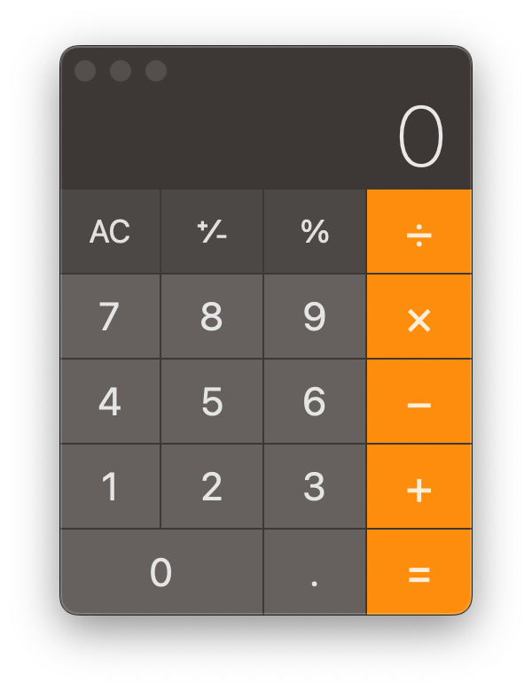

# Junxuan Bao's Learning Journey

这个项目的设立初衷是为了通过分享我的个人经验帮助更多的人学习编程。在这个教程中，我不直接教授编程相关的知识，而是帮助你寻找一些第三方资料。

本项目发起人也缺乏专业知识，只是分享自己的入门经验，**因此本项目只适合用于入门**。

**⚠️ 本项目尚未完成 ⚠️**

---

### 了解编程

首先你需要了解编程有哪些分类，以及这些分类下具体包含哪些编程语言，这样你才能更好的选择适合你自己的编程语言。

编程大致分为两个部份：**前端和后端**。**`前端`** 负责把内容展示给用户，而 **`后端`** 则负责处理内容。举个栗子 🌰：

> 我们常用的电脑计算机：
>
> 
>
> 上图就是一个前端页面，这个页面主要负责 **`输入和输出`** 。
>
> 在这个例子中，用户在前端通过按钮输入了 `1+1=` 但是前端并不知道答案是多少，于是它会把 `1+1=` 发送给后端，后端会计算出来结果，那就是 `2` ！后端计算完成之后会把 `2` 返回给前端，然后前端再把结果 `2` 展示给用户。

因此，程序大概的运作流程是： `用户在前端输入数据 -> 前端把数据传递给后端 -> 后端进行运算处理 -> 后端把数据返回给前端口 -> 前端把结果展示给用户`

> **⚠️ 注意：本教程中对于前段和后端的定义并不是完全准确，甚至说可能完全不准确，这是为了更好的帮助完全没学习过编程的小伙伴们理解。随着学习的深入，各位会慢慢了解真正的前后端定义。**

---

### 选择适合你的语言

现在，你应该已经大概了解了 `前端和后端` ，是时候选择适合你的语言了！（宝可梦即视感

#### 第一步：确认你想要最终产出的内容

通常来说，你在学习完第一个语言后可能会产出以下内容：

* 一个网页前端：像是百度、谷歌那样的网页，但是没有实际的作用，更多的只是展示固定的内容
* 一个简单的命令行工具：没有图形界面，通过文字的方法输入一些内容并且得到输出结果

其实不难发现，这两个对应的就是上面介绍过的前端和后端，如果你选择第一个，那也许你更适合进行前端的学习，如果你选择第二个，那你也许更偏向于后端。当然，你也可以选择我全都要，这种情况下你未来的目标就是进行 `全栈` 开发，即前段+后端！（~~虽然现在都主张前后端分离，方便不同的人开发，但是在小公司中大部分情况下还是会让同一个人同时进行这两个~~）在这个情况下，你可以两个都学（其实有一些语言也可以同时实现两个功能）。我本人是先学习后端再学习前端的，但是如果让我重新做一次选择，我可能会选择从前端开始，因为**前端通常来说更加容易理解**，并且更能直观的看到自己的成果，比较有成就感。

#### 第二步：确认语言和学习路径

首先说明，这绝对不是全部适合入门的语言，其中很多语言已经过时或即将被淘汰，但是就像我开头所说的那样，这个项目的初衷是分享我个人的入门经验，所以我只介绍我比较了解并已经学习过的语言。

* HTML：纯前端 -> 进入 web-front-end 文件夹继续学习
  * 简单易学
  * 绝大部分入门人的入门选择
  * 未来学习路径：HTML -> CSS -> JavaScript（包含部分后端内容） -> Vue等框架
  * 完成上述学习路径后你就可以制作出来一个完整的前端网页，可以进行简单的交互，例如验证一个表单内容是否有效并提交给后端
  * **适合纯小白+想要快速看到成果的人群**
* Swift：全栈
  * 目前只能用来进行苹果全家桶的开发
  * 官方文档和入门工具比较完善
  * 平台比较统一，网上的资料也比较统一
  * 只需要学习一个语言就可以完成手机电脑电视甚至MR的软件开发！
  * 如果你对于iOS、MacOS、WatchOS、tvOS、visionOS感兴趣，那你可以从这里开始
  * 未来学习路径：Swift -> Swift UI
  * 完成上述学习路径以后你可以制作出来一个完整的苹果平台软件
  * **适合对苹果系统有绝对热爱的人群**
* Java：偏向后端，但是也可以进行前端开发
  * 难度较高，涉及到面对对象一类较为抽象的知识点
  * 比较通用，是目前就业岗位比较多的语言
  * 能够完成很多复杂的操作和功能
  * 未来学习路径：Java SE -> Java EE -> SpringBoot等框架
  * 完成上述学习路径后你可以制作一个后端程序
  * **适合有明确目标并且希望快速就业的人群**
* python：偏向后端，但是也可以进行前端开发
  * 相对比较简单，也有很多人用来入门
  * 但是相对于HTML而言，没有那么快和直观的看到自己的产出
  * 学习python更多的用于数据处理分析等制作日常个人小工具
  * 由于其语言特点，大企业在应用程序上用的不算很多
  * **适合想要制作一些个人生活工具来Make Life Easier的情况**

上述四种语言是我建议的入门选择，当然，再次重申：**这不是你的全部选择，我只是基于我个人学过的语言筛选出来的结果**。

> 确认好语言后就可以进入各自的语言学习路径文件夹开始学习咯！提前祝你一路顺风，学有所成！🎆
